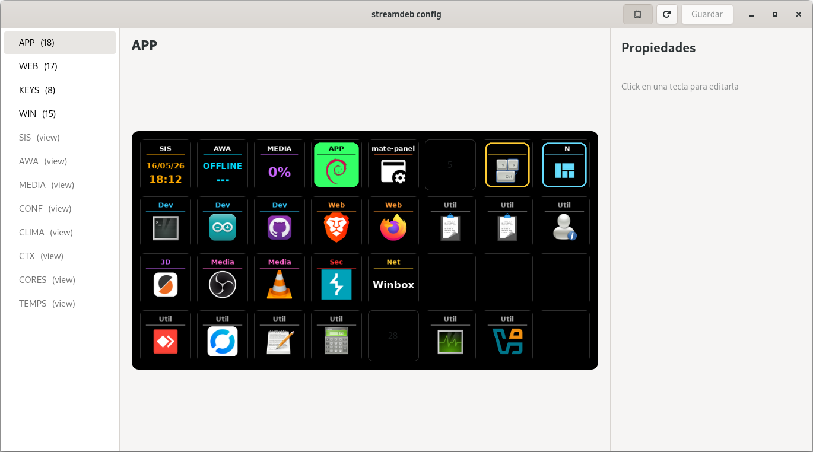
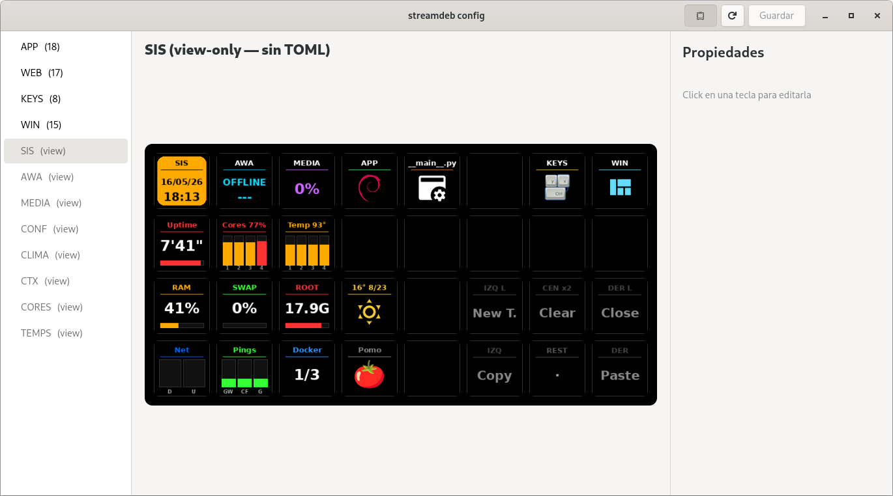

# streamdeb — Stream Deck dashboards

Two independent Python applications for the Elgato Stream Deck XL,
running on Debian:



The GUI configurator (`streamdeb-config`) mirrors the deck output
tile-by-tile in real time. The first screenshot above is the **APP**
launcher page (editable). Below: the **SIS** view-only page reflecting
the dashboard's live widgets — clock, CPU cores, temperature, RAM,
weather, pomodoro, network, docker — exactly as the physical deck
renders them.



| App                  | Host                          | Service                | Purpose                                  |
|----------------------|-------------------------------|------------------------|------------------------------------------|
| `dashboard_pro.py`   | PC `dinamo` (Debian)          | `streamdeb` (--user)   | General-purpose dashboard (5 pages)      |
| `awa_kiosk.py`       | Raspberry Pi 3 (headless)     | `awa-kiosk` (system)   | Dedicated AWAhorro control panel         |

Both talk to the **AWAhorro Base** ESP32 at `192.168.18.10` (water-valve
controller). API documented in [`API.md`](API.md).

> `main.py` is the original repository scaffold and is not used.

---

## 1) `dashboard_pro.py` — PC dashboard

Stream Deck XL (32 keys · 4 rows × 8 columns · 96×96 px). Runs as a
`systemd --user` service started with the graphical session of user
`jfqp`.

### Layout — 5 pages + shared nav

Row 0 (visible on every page):

| Key | Button | Function                                                    |
|-----|--------|-------------------------------------------------------------|
| 0   | SIS    | Page 1 — system                                             |
| 1   | AWA    | Page 2 — AWAhorro control                                   |
| 2   | MEDIA  | Page 3 — multimedia                                         |
| 3   | APP    | Page 4 — application launcher                               |
| 7   | CONF   | Page 5 — configuration (gear icon)                          |

> The old red X (power off / manual dim) no longer lives in row 0; it
> now sits inside the CONF page (key 31).

#### SIS page (default)

```
Row 1:  Uptime  Cores   Temp    .      .    .    .    .
Row 2:  RAM     SWAP    ROOT   Weather .    .    .    .
Row 3:  Net     Pings   Docker  POMO   .    .    .    .
```

- **Cores** (key 9): title `Cores N%` (total CPU) + 4 vertical bars per
  core. Tap → CORES subpage (id 13) with per-core detail (C1–C4), top 5
  CPU processes and top 5 memory (GB).
- **Temp** (key 10): title `Temp N°` (core average) + 4 temperature
  bars. Bar maps [65..105°C]→0..100% (calibrated for a fanless Celeron
  J4105). Colors: ≤82 green, 82–92 yellow, 92–100 amber, >100 red.
  Tap → TEMPS subpage (id 16) with Package + cores + other sensors
  (acpitz, wifi).
- **Net** (key 24): 2 D/U bars scaled to the observed peak. Tap → NET
  subpage (id 15) with current DOWN/UP + peak, total RX/TX, packet
  counts and errors/drops.
- **Pings** (key 25): 3 bars (GW/CF/G) colored by relative latency.
  Tap → PINGS subpage (id 14) with per-target detail (current / avg /
  max·min) + public and local IPs.
- **Weather** (key 19): WMO icon + current temp + min/max. Tap →
  WEATHER page (id 11) with banner + 24h meteogram + 12h strip.
- **POMO** (key 27): 25/5 pomodoro. Short tap advances state, long-press
  ≥2s resets.
- **Docker** (key 26): running/total. Tap → DOCKER page (id 10).

#### AWA page

```
Row 1: Status  Count  Mode  Open   WiFi  Tank  User    Admin
Row 2: 1MIN    2MIN   3MIN  4MIN   5MIN   .     .      Ping API
Row 3: 15MIN   30MIN  1HOUR 2HOURS  .     .     .      CLOSE
```

- Status: green background if Open · red outline if Closed · gray if OFFLINE.
- Time buttons: **glass-emptying** effect (cyan that decreases) on the
  button whose duration matches `initial_seconds` from the API.
- `CLOSE` (key 31): red, sends `{"action":"close"}`.

#### MEDIA page

```
Row 1:   .   .   .   .   .   .   .   VOL+
Row 2:   .   .   .   .   .   .  PLAY  MUTE
Row 3:   .   .   .   .   .   .   .   VOL-
```

- VOL+/MUTE/VOL− stacked in the last column (15, 23, 31), PLAY on key 22.
- Commands: `pactl set-sink-volume`, `pactl set-sink-mute`, `playerctl play-pause`.

#### APP page — launcher

System theme PNG icons (hicolor / mate / gnome). Current apps in
`APPS_PAGINA` (`dashboard_pro.py:93`):

- Dev: Term, Arduino, GitHub Desktop
- Web: Brave, Firefox (firejail)
- 3D: PrusaSlicer
- Media: OBS, VLC
- Sec: Burp Suite
- Net: Winbox (wine)
- Util: AnyDesk, SysMon, VirtualBox

#### CONF page — live configuration

Settings editable without restarting the service:

- **Brightness** (col 0): +, current %, − (step 10%, min 10, max 100).
- **SIS fallback** (col 1): seconds without interaction before returning
  to SIS. Range 60s – 30min, step 1 min.
- **Auto-dim** (col 2): seconds without interaction before the screen
  dims. Range 60s – 2h, step 1 min.
- **Monitor brightness** (col 3): xrandr gamma brightness for the
  external display. +, current %, −.
- **Kiosk profile** (key 15, below the gear): switches to the
  `streamdeb-kiosk` service (see Profile switch below).
- **Power-off X** (key 31, manual dim).

### Cross-cutting behaviors

- **Auto-fallback to SIS** and **auto-dim** using the values configured
  in CONF (no more hardcoded constants).
- **Reconnect**: if the deck disconnects, it retries every 2 s and
  restores state on reconnect.
- **Time-based theme**: light 05:30–22:00, dark otherwise (override
  available from CONF).

### Setup

```bash
sudo apt install python3-venv libhidapi-hidraw0 libhidapi-libusb0
python3 -m venv .venv
.venv/bin/pip install -r requirements.txt psutil pynput

sudo cp udev/50-streamdeck.rules /etc/udev/rules.d/
sudo udevadm control --reload-rules && sudo udevadm trigger
# unplug and reconnect the deck

systemctl --user daemon-reload
systemctl --user enable --now streamdeb.service

# optional: keep it running without a graphical session
sudo loginctl enable-linger jfqp
```

### Operation

```bash
systemctl --user status  streamdeb
systemctl --user restart streamdeb       # after editing dashboard_pro.py
journalctl --user -u streamdeb -f
```

### Profile switch (main ↔ kiosk on dinamo)

On dinamo the deck can run `awa_kiosk.py` as a temporary profile
without needing the Pi:

- Parallel service `streamdeb-kiosk.service` under
  `~/.config/systemd/user/` (versioned in `systemd/`).
- Helper `bin/switch-profile.sh {main|kiosk}` performs the atomic swap:
  it launches the `start` of the new service as a **transient unit**
  (`systemd-run --user`) so that it survives the `stop` of the current
  one (whose cgroup-kill takes everything down). Waits 1.5s before
  starting so the USB deck is released.
- Button in CONF on each app:
  - main: key **15** "Kiosk profile" (col 7 row 1, below the gear).
  - kiosk: key **11** "Main profile" (only shown if the helper exists,
    so it is not rendered on the Pi).
- Both apps trap SIGTERM to close the deck cleanly inside `finally`.

Set up the kiosk service on dinamo:
```bash
cp systemd/streamdeb-kiosk.service ~/.config/systemd/user/
systemctl --user daemon-reload
# no `enable` — it is only launched through the button
```

### Declarative config + GUI (work in progress)

The four user-editable pages — **APP**, **WEB**, **KEYS**, **VENT** — read
their button definitions from a TOML file:

1. `$STREAMDEB_CONFIG` if set,
2. `~/.config/streamdeb/config.toml` (your overrides),
3. `config/default.toml` (shipped with the repo, fallback).

The running service polls the mtime of these files every 2 s and reloads
the affected plugins **without a restart**. A schema error keeps the
last good state and logs the issue:

```bash
# bootstrap your personal config from the default
cp config/default.toml ~/.config/streamdeb/config.toml
# edit and save — the deck refreshes within ~3 s
```

A GTK4 GUI configurator (`bin/streamdeb-config`) mirrors the live
deck output (per-tile, bidirectional clicks) and lets you edit
labels, commands, icons and shortcuts. App-picker scans
`*.desktop`; icon-picker reads the system theme.

Run from the source tree:
```bash
sudo apt install python3-gi gir1.2-gtk-4.0 python3-elgato-streamdeck
./bin/streamdeb-config
```

Build a system-wide `.deb` (lands in your applications menu under
*System Tools*):
```bash
./packaging/build.sh
sudo dpkg -i streamdeb-config_1.0.0_all.deb
sudo apt -f install   # pull deps if missing
streamdeb-config       # or launch from the menu
```

---

## 2) `awa_kiosk.py` — Raspberry Pi kiosk

Stream Deck XL on a **headless Raspberry Pi 3**. The Pi has no monitor;
the deck is the only interface. Dedicated to AWAhorro control.

- OS: Raspberry Pi OS Lite 64-bit (Debian 13 trixie).
- Hostname: `awa`. User: `jfqp` (in the `plugdev` group).
- **System** service (not user): `/etc/systemd/system/awa-kiosk.service`.
- Code at `/opt/streamdeb/`, venv at `/opt/streamdeb/.venv/`.

### Layout (single page + CONF)

```
AWA page (default):
  Row 0:  Ext   Both  Tank  Inten Mix   Eco   Fast  Pre        ← modes + dishwasher
  Row 1:  Status Count Mode  Open  WiFi  Tank  User   Admin    ← API state
  Row 2:  1MIN  2MIN  3MIN  4MIN  5MIN   .     .     PingAPI
  Row 3:  15MIN 30MIN 1HOUR 2HOURS .     .    CONF    CLOSE

CONF page:
  Row 1:  Bright+ Dim+  .    [Main]  .    .    .    Daytime theme
  Row 2:  Bright% Dim%  .    .       .    .    .    .
  Row 3:  Bright− Dim−  .    .       .    .    AWA  X (power off)
```

`[Main]` (key 11) only renders on dinamo (returns to the main
profile). It does not appear on the Pi.

**Behaviors:**

- **Brightness** and **Dim** work in both themes (light/dark).
- **Auto-redim 2s in dark**: after pressing an opening button or CLOSE
  while in the dark theme, the deck dims to 0 after 2s (silent kiosk
  at night). Any touch wakes it up.
- **Deck ping while dimmed**: every 1s a `set_brightness(0)` ping
  detects USB drop-outs that would otherwise go unnoticed.
- **CLOSE drained**: in light theme, outline only when already closed;
  solid red when an opening is active. In dark theme, faint gray when
  closed, red when open.

### Configuration (env vars in the .service)

```
STREAMDEB_API_HOST   (default http://192.168.18.10)
STREAMDEB_API_USER   (default Kiosko)
STREAMDEB_BRILLO     (default 75)
STREAMDEB_DIM        (default 1800)
```

### Hardware notice

The Stream Deck XL draws ~500 mA over USB. A Pi 3 with a weak power
supply experiences **undervoltage** (visible as `Undervoltage detected!`
in `dmesg`) and the deck re-enumerates in a loop. Fixes:

1. Official Pi 5V 2.5A power supply (or 5.1V 3A).
2. Self-powered USB hub between the Pi and the deck (recommended).

### Provisioning the Pi (quick, from dinamo)

```bash
# 1) install deps
ssh jfqp@<pi> 'sudo apt install -y python3-venv libhidapi-libusb0 \
    libusb-1.0-0 libjpeg-dev zlib1g-dev libfreetype-dev rsync tzdata'

# 2) sync the repo to /opt/streamdeb
ssh jfqp@<pi> 'sudo mkdir -p /opt/streamdeb && sudo chown jfqp:jfqp /opt/streamdeb'
rsync -az --exclude='.venv' --exclude='.git' --exclude='__pycache__' \
    ./ jfqp@<pi>:/opt/streamdeb/

# 3) venv + Python deps
ssh jfqp@<pi> 'cd /opt/streamdeb && python3 -m venv .venv && \
    .venv/bin/pip install -r requirements.txt'

# 4) udev + service (use User=jfqp inside awa-kiosk.service)
ssh jfqp@<pi> 'sudo cp /opt/streamdeb/udev/50-streamdeck.rules /etc/udev/rules.d/ && \
    sudo udevadm control --reload-rules && sudo udevadm trigger'
ssh jfqp@<pi> 'sudo cp /opt/streamdeb/systemd/awa-kiosk.service /etc/systemd/system/ && \
    sudo systemctl daemon-reload && sudo systemctl enable --now awa-kiosk'
```

### Operation

```bash
ssh jfqp@<pi> 'sudo journalctl -u awa-kiosk -f'
ssh jfqp@<pi> 'sudo systemctl restart awa-kiosk'
```

---

## Layout

```
streamdeb/
├── dashboard_pro.py                 # PC dinamo app (5 pages)
├── awa_kiosk.py                     # kiosk app (Pi and dinamo profile)
├── main.py                          # original scaffold (unused)
├── API.md                           # AWAhorro ESP32 API
├── requirements.txt                 # streamdeck, Pillow
├── bin/switch-profile.sh            # main↔kiosk swap on dinamo
├── udev/50-streamdeck.rules         # USB access without root (plugdev)
├── systemd/awa-kiosk.service        # system service for the Pi
├── systemd/streamdeb-kiosk.service  # user kiosk service on dinamo
└── .venv/                           # local virtualenv (dinamo only)
```

## License

MIT — see [`LICENSE`](LICENSE).
