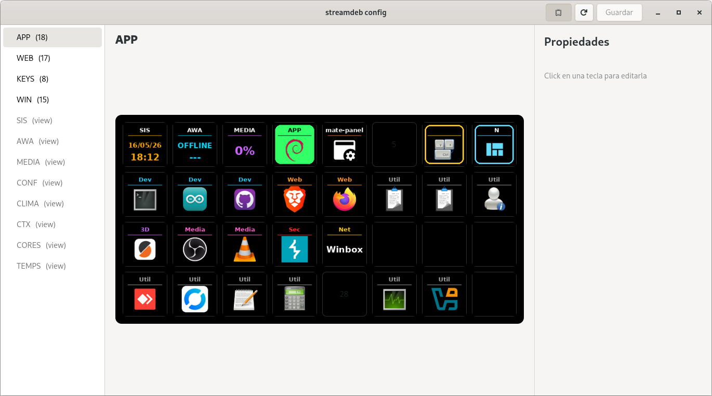
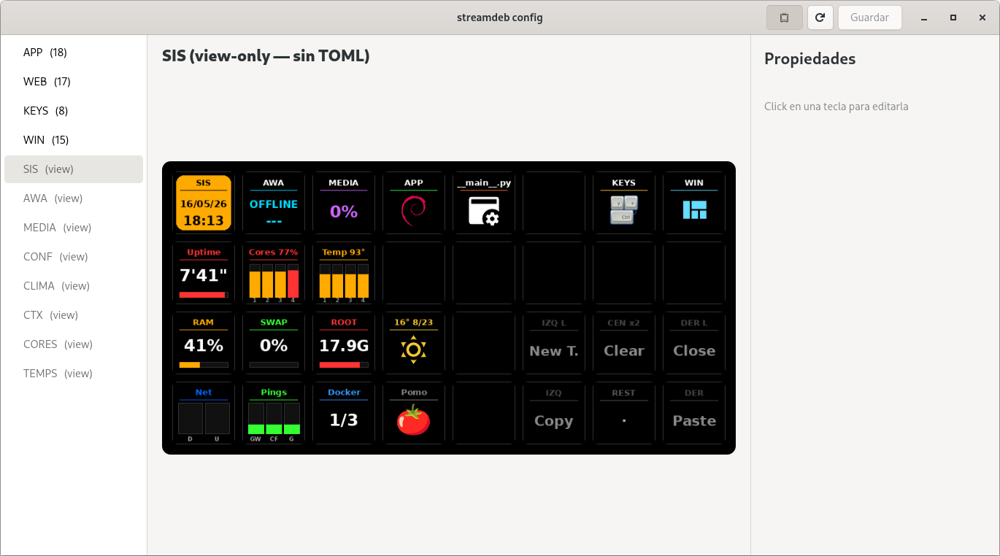
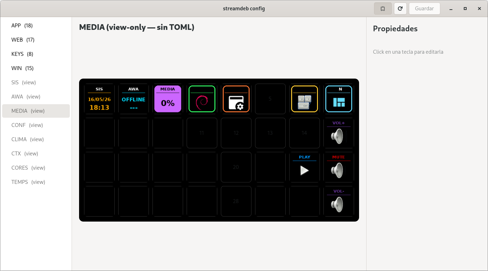
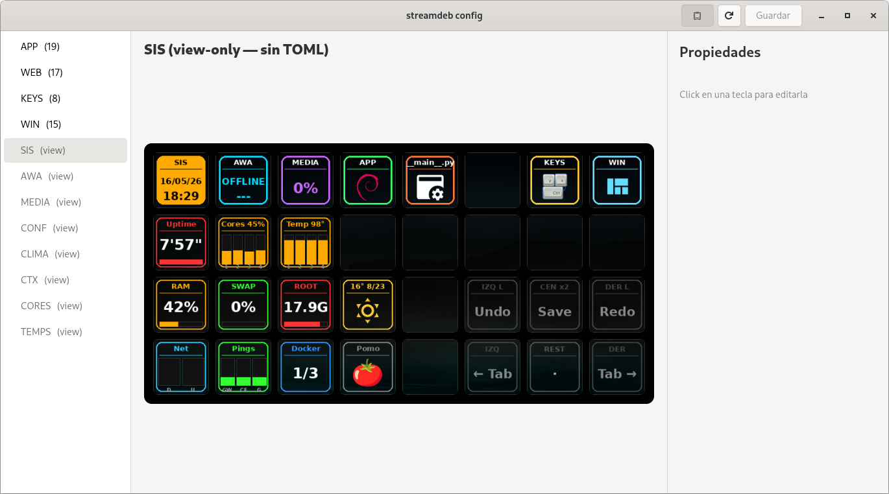
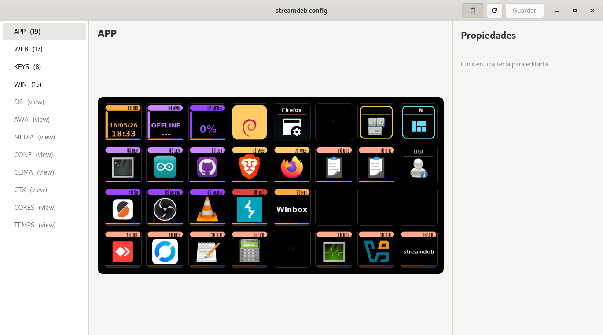
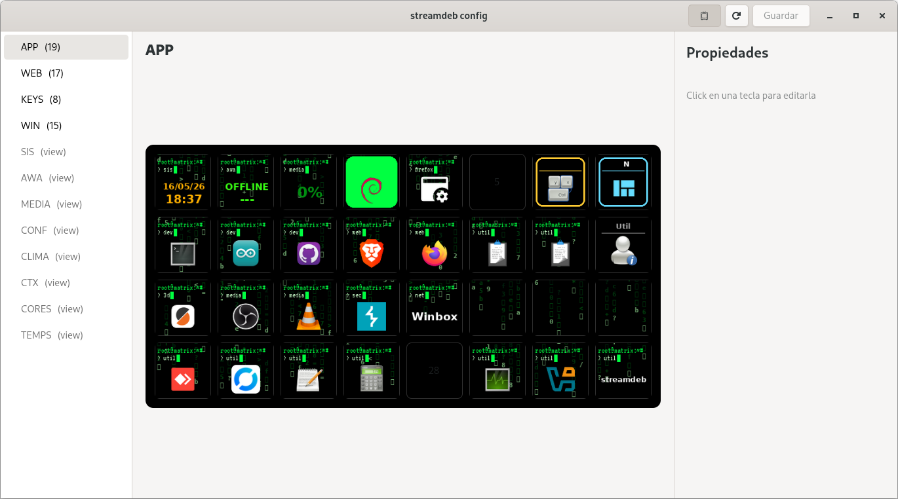
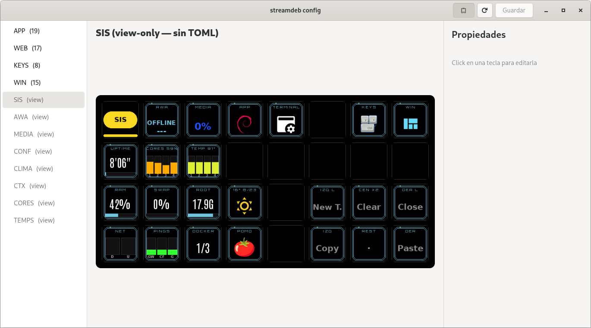
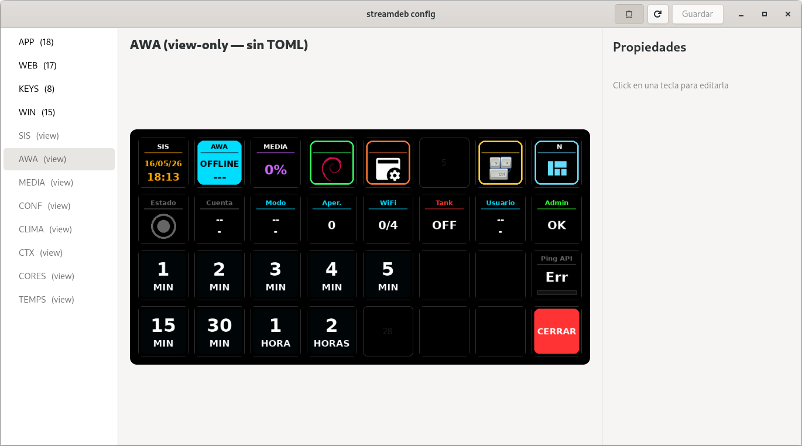

# streamdeb — Stream Deck dashboards for Linux

A Python implementation of live dashboards for the Elgato Stream Deck XL
on Linux (Debian), built around a **plugin architecture** (`core/` +
`plugins/`): system monitor, app launchers, context-aware shortcuts,
Docker control, weather, solar-inverter telemetry, a foot pedal, a GUI
configurator, LCARS themes, and more — each feature is a self-contained
plugin. Among them, AWAhorro water-valve control (ESP32 over HTTP) is
just one plugin.



The GUI configurator (`streamdeb-config`) mirrors the deck output
tile-by-tile in real time. The first screenshot above is the **APP**
launcher page (editable). Below: the **SIS** view-only page reflecting
the dashboard's live widgets — clock, CPU cores, temperature, RAM,
weather, network, docker — exactly as the physical deck
renders them.



The **MEDIA** page — another general-purpose plugin — mirrors volume and
playback controls (VOL±, play/pause, mute) alongside the shared nav row:



### Visual profiles and themes

Three render profiles, rotated from the **Perfil V** key in CONF.
Profile 1 paints coloured frames around every tile; profile 2 is the
clean look above; profile 3 is themed chrome with **thirteen** sub-themes
that live in `plugins/themes/` (`classic`, `voyager`, `nemesis`,
`cardassia`, `lowerdecks`, `cyberpunk`, `synthwave`, `tron`, `matrix`,
`halloween`, `minimal_dark`, `twitch_rgb`, `terminal_ide`). Each theme
declares its own chrome, so a non-Trek palette doesn't get LCARS elbows.
The Perfil V key walks `1 → 2 → 3·<theme 1> → 3·<theme 2> → … → back to 1`.

| Profile 1 + galaxy wallpaper | LCARS · voyager | LCARS · matrix | LCARS · tron |
| --- | --- | --- | --- |
|  |  |  |  |

Wallpapers live in `~/Pictures/wallpapers/` — drop any `.jpg`/`.png`
there and the deck auto-detects them (no restart). Rotate with the
wallpaper key in CONF; long-press turns it off.

The main application is the general-purpose dashboard; the kiosk is an
optional, stripped-down variant that runs only the AWAhorro plugin on a
headless Pi.

| App                  | Host                          | Service                | Purpose                                  |
|----------------------|-------------------------------|------------------------|------------------------------------------|
| `dashboard_pro.py`   | PC `dinamo` (Debian)          | `streamdeb` (--user)   | General-purpose dashboard (multi-page)   |
| `awa_kiosk.py`       | Raspberry Pi 3 (headless)     | `awa-kiosk` (system)   | Optional dedicated AWAhorro-plugin panel |

The AWAhorro plugin (`plugins/awa.py`, page 2) talks to an **AWAhorro
Base** ESP32 over HTTP (water-valve controller); it's one integration
among many and entirely optional. API documented in [`API.md`](API.md).



Its page shows live valve status (state, countdown, mode, Wi-Fi, tank,
admin lock) and timed-open actions (1–5 min, 15/30 min, 1/2 h) plus a
**CERRAR** (close) button — all driven by the ESP32 over HTTP.

> `main.py` is the original repository scaffold and is not used.

---

## 1) `dashboard_pro.py` — PC dashboard

Stream Deck XL (32 keys · 4 rows × 8 columns · 96×96 px). Runs as a
`systemd --user` service started with the graphical session of user
`jfqp`.

### Navigation row (row 0, visible on every page)

| Key | Button | Goes to                                                  |
|-----|--------|----------------------------------------------------------|
| 0   | SIS    | Page 1 — system. **Long-press ≥2 s → CONF (page 5)**      |
| 1   | AWA    | Page 2 — AWAhorro control                                |
| 2   | MEDIA  | Page 3 — multimedia                                      |
| 3   | APP    | Page 4 — application launcher                            |
| 4   | CTX    | Page 12 — context-aware shortcuts                        |
| 5   | —      | free                                                     |
| 6   | KEYS   | Page 7 — keyboard shortcuts                              |
| 7   | WIN    | Page 8 — window tiling                                   |

CONF has no nav button of its own: it is the long-press of key 0. Two
more pages are reached indirectly — **WEB** (6) from CTX when a browser
is focused, and **GROWATT** (17) from the PV widget on SIS.

### All pages

| id | Page    | Entry point                    |
|----|---------|--------------------------------|
| 1  | SIS     | nav key 0                      |
| 2  | AWA     | nav key 1                      |
| 3  | MEDIA   | nav key 2                      |
| 4  | APP     | nav key 3                      |
| 5  | CONF    | long-press nav key 0           |
| 6  | WEB     | from CTX (browser focused)     |
| 7  | KEYS    | nav key 6                      |
| 8  | WIN     | nav key 7                      |
| 10 | DOCKER  | SIS key 26                     |
| 11 | WEATHER | SIS key 19                     |
| 12 | CTX     | nav key 4                      |
| 13 | CORES   | SIS keys 8–9                   |
| 14 | PINGS   | SIS key 25                     |
| 15 | NET     | SIS key 24                     |
| 16 | TEMPS   | SIS keys 10–11                 |
| 17 | GROWATT | SIS key 12                     |

#### SIS page (default)

```
Row 1: Cores1-4 Cores5-8 Temp1-4 Temp5-8  PV     .      .      .
Row 2:  RAM     ZRAM    ROOT    Weather  .   IZQ L  CEN x2  DER L
Row 3:  Net     Pings   Docker  GridW  Uptime IZQ    REST    DER
```

- **Cores** (keys 8–9): four vertical bars per tile, so an 8-core CPU reads
  as two tiles, each titled with **that group's own average**. Bars are
  labelled with their real core number. Total CPU is not on SIS — it lives in
  the CORES subpage (id 13), reached by tapping either tile, along with one
  core per key, top 5 CPU processes and top 5 memory (GB).
- **Temp** (keys 10–11): same split and the same titling — one tile per group
  of four, each showing its own average. **Scale and colours come from the sensor itself**, not
  from hardcoded constants: the bar covers the last 35 °C before `critical`,
  and the colours are green up to 10° below `high`, yellow to `high`, amber to
  `critical`, red above. Tap → TEMPS subpage (id 16) with one core per key plus
  Package, critical, and the other sensors (nvme, pch, wifi) and fans.
- **PV** (key 12): 4 auto-scaled bars from the Growatt plugin — PV,
  battery discharge, grid import, house load, with battery charge stacked
  on top of the load bar. Tap → GROWATT page (id 17).
- **RAM** (key 16) and **ZRAM** (key 17): RAM shows the **available** GB —
  the figure `earlyoom` watches to decide when to kill the biggest consumer —
  with the used percentage underneath, matching the bar. Colour follows the
  headroom: green above 20 % available, amber down to 10 % and red below,
  where earlyoom starts firing. ZRAM shows what compressed swap actually **costs in RAM**
  plus its compression ratio, because on a zram-only machine the "swap used"
  percentage is a fraction of a nominal cap that is never reserved. Falls back
  to a plain SWAP tile on machines without zram.
- **Weather** (key 19): WMO icon + current temp + min/max. Tap →
  WEATHER page (id 11) with banner + 24 h meteogram + 12 h strip.
- **Net** (key 24): 2 bars on a **logarithmic scale** (1 kb/s → 100 Mb/s),
  each labelled with its own throughput — **purple for download, blue for
  upload**, the same pairing on the detail page. Throughput spans five
  orders of magnitude — idle chatter of ~10 kb/s against downloads of
  100 Mb/s — and no linear bar can show both ends: a low ceiling saturates
  while browsing, a high one makes normal use invisible. Only **physical
  interfaces** are counted (those with a real device in `/sys/class/net`), so
  Docker bridges, loopback and VPNs don't double-count traffic that also
  crosses the NIC. Tap → NET subpage (id 15) with current DOWN/UP, the
  5-minute peak, total RX/TX, packet counts and errors/drops.
- **Pings** (key 25): 3 bars (GW/CF/G) colored by relative latency.
  Tap → PINGS subpage (id 14) with per-target detail (current / avg /
  max·min) + public and local IPs.
- **Docker** (key 26): running/total. Tap → DOCKER page (id 10).
- **GridW** (key 27): health of [grid-watch](https://github.com/dlocmot/grid-watch),
  the companion service that alerts when the public grid fails. Read over SSH
  every 5 min. Green when it is watching and the grid is up, red during an
  outage, amber when it stops responding — because a dead watchdog and a quiet
  one look identical from your phone.
- **Uptime** (key 28): time since boot, beside GridW.
- **Pedal tiles** (keys 21/22/23 and 29/30/31): read-only indicators for
  the Stream Deck Pedal — see [Foot pedal](#foot-pedal) below.

#### AWA page

```
Row 1: Status  Count  Mode   Opens  WiFi  Tank  User   Admin
Row 2: 1MIN    2MIN   3MIN   4MIN   5MIN   .    Ping    .
Row 3: 15MIN   30MIN  1HOUR  2HOURS  .     .     .     CLOSE
```

- Status (key 8): green background if Open · red outline if Closed ·
  gray if OFFLINE.
- Count (key 9) is the live countdown; Opens (key 11) is the open counter
  since the ESP32 booted.
- Time buttons (16–20, 24–27): **glass-emptying** effect (cyan that
  decreases) on the button whose duration matches `initial_seconds` from
  the API.
- `CLOSE` (key 31): red, sends `{"action":"close"}`.

#### MEDIA page

```
Row 1:   .   .   .   .   .   .   .   VOL+
Row 2:   .   .   .   .   .   .  PLAY  MUTE
Row 3:   .   .   .   .   .   .   .   VOL-
```

- VOL+ (15) / MUTE (23) / VOL− (31) stacked in the last column, PLAY on key 22.
- Commands: `pactl set-sink-volume`, `pactl set-sink-mute`, `playerctl play-pause`.

#### APP · WEB · KEYS · WIN — defined in TOML

These four pages hold **no button definitions in Python**. They are read
from a TOML file (see [Declarative config](#declarative-config--gui)) and
hot-reloaded within ~3 s of saving:

- **APP** — launchers with system-theme PNG icons (hicolor / mate /
  gnome). Shipped defaults: Term, Arduino IDE, GitHub Desktop, Brave,
  Firefox (firejail), PrusaSlicer, OBS, VLC, Burp Suite, Winbox (wine),
  AnyDesk, RustDesk, Pluma, Calc, SysMon, VirtualBox. Every app is
  launched through `systemd-run --user --scope`, so it lives outside the
  service's cgroup and survives a dashboard restart.
- **WEB** — URL launchers with auto-fetched favicons (plus per-URL icon
  overrides). Entered from CTX when a browser has focus.
- **KEYS** — keyboard shortcuts, either `combo` (`ctrl+shift+c`,
  `print_screen`, `super+l`, …) or `type` (types a string).
- **WIN** — window tiling via `wmctrl`, with geometries precomputed for a
  3840×1200 desktop.

#### CTX page

Polls `xprop` every 0.7 s for the focused window's `WM_CLASS` and shows
the shortcuts registered for that app (currently `mate-terminal` and
Firefox, under its several instance names). Shortcuts may be key combos
or `@page:N` jumps — that is how a focused browser routes you to WEB.
The same signal reconfigures the foot pedal bindings.

#### GROWATT page

Solar inverter dashboard read from `server.growatt.com` via the
`growattServer` library. Left 3×3 block reproduces the vendor's energy
flow (solar on top, grid left, load right, battery below, inverter in the
centre); columns 3–7 hold five metric cards (PV output, battery
discharge, battery charge, grid import, consumption) plus status,
battery SOC and grid voltage/frequency.

Polling is every 5 min with exponential backoff up to 30 min — the cloud
only receives a push from the dongle every ~5 min, so polling faster just
burns quota. Polling **pauses while the deck is dimmed** and fires
immediately on wake. Credentials go in
`~/.config/streamdeb/growatt.toml` (preferred) or
`plugins/growatt/credentials.toml` — both gitignored; see
`credentials.toml.example`.

#### CONF page — live configuration

Reached with a long-press on key 0. Everything is editable without
restarting the service, and persisted to `~/.config/streamdeb/state.json`:

```
Row 1:  Bright+  Fallback+  Dim 30m  Monitor+  Wallpaper  .  Perfil V    .
Row 2:  Bright%  Fallback   Dim 1h   Monitor      .       .     .        .
Row 3:  Bright−  Fallback−  Dim Fijo Monitor−     .       .     .        X
```

- **Brightness** (col 0): step 10 %, range 10–100.
- **SIS fallback** (col 1): seconds without interaction before returning
  to SIS. Range 60 s – 30 min, step 1 min.
- **Auto-dim** (col 2): three fixed choices, one per key — **30m** (10),
  **1h** (18) and **Fijo** (26), the active one highlighted. *Fijo* disables
  the automatic dim entirely; the manual power-off X still works.
- **Monitor brightness** (col 3): `xrandr --brightness` on the active
  output (auto-detected, override with `STREAMDEB_MONITOR_OUTPUT`).
- **Wallpaper** (key 12): short press rotates, long-press ≥2 s turns it off.
- **Perfil V** (key 14): rotates render profile and theme.
- **Power-off X** (key 31): manual dim.

#### Foot pedal

An Elgato Stream Deck Pedal (3 switches, no screen) is picked up as an
auxiliary input by `plugins/pedal.py`. It has no page of its own — its
six SIS tiles are live indicators, not buttons:

| Slot            | SIS tile | Gesture                        |
|-----------------|----------|--------------------------------|
| `tap_izq`       | 29       | short tap, left pedal          |
| `tap_der`       | 31       | short tap, right pedal         |
| `hold_izq`      | 21       | hold ≥1.2 s, left pedal        |
| `hold_der`      | 23       | hold ≥1.0 s, right pedal       |
| `double_cen`    | 22       | double-tap, centre pedal       |
| (REST)          | 30       | centre pedal at rest — ignored |

The centre pedal is treated as a footrest (Elgato ships stoppers for it),
so only a deliberate double-tap registers there. Bindings are
context-aware: `plugins/pedal_apps/<wm_class>.py` maps the focused app to
the five slots, and CTX reconfigures them on the fly. Bundled:
`default`, `firefox`, `mate-terminal`, `vlc`, `code`.

### Cross-cutting behaviors

- **Auto-fallback** to SIS and **auto-dim**, both using the values configured
  in CONF. WEB, KEYS and GROWATT are excluded from the fallback.
- **USB recovery, two layers**: the main loop checks `deck.connected()`
  on every iteration and transparently reopens the device when it
  re-enumerates (suspend, power glitch, cable). A system unit
  (`systemd/streamdeb-resume.service`) additionally restarts the service
  after suspend — writes to a stale handle do *not* raise, so without
  these the screen would freeze silently.
- **Render caching**: panels are memoized by content, the nav row is
  cached, encoded tiles are cached by identity, and identical bytes are
  never re-sent over USB. Live pages (metrics, polling, clock) repaint
  every second; static pages only on demand. Any key press wakes the loop
  immediately.

### Setup

```bash
sudo apt install python3-venv libhidapi-hidraw0 libhidapi-libusb0
python3 -m venv .venv
.venv/bin/pip install -r requirements.txt

sudo cp udev/50-streamdeck.rules /etc/udev/rules.d/
sudo udevadm control --reload-rules && sudo udevadm trigger
# unplug and reconnect the deck

systemctl --user daemon-reload
systemctl --user enable --now streamdeb.service

# optional: keep it running without a graphical session
sudo loginctl enable-linger jfqp

# optional: recover automatically after suspend
sudo bash systemd/install-resume-hook.sh
```

Useful environment variables (set them in the unit):
`STREAMDEB_DECK_SERIAL` (pin to one deck when several are plugged in),
`STREAMDEB_CONFIG`, `STREAMDEB_JPEG_QUALITY`, `STREAMDEB_LIVE_PREVIEW`,
`STREAMDEB_MONITOR_OUTPUT`, `STREAMDEB_POLL_HZ`.
`python3 dashboard_pro.py --dummy` renders to a PNG mosaic in
`/tmp/streamdeb-preview/deck.png` with no hardware attached.

### Operation

```bash
systemctl --user status  streamdeb
systemctl --user restart streamdeb       # after editing the code
journalctl --user -u streamdeb -f
```

### Two decks, one role each (dinamo)

dinamo drives **two Stream Deck XL**, each with a fixed role — there is no
switching between them:

| Deck serial      | Service                  | App                | Role                        |
|------------------|--------------------------|--------------------|-----------------------------|
| `CL44I1A04650`   | `streamdeb.service`      | `dashboard_pro.py` | General dashboard           |
| `CL40I1A03955`   | `streamdeb-kiosk.service`| `awa_kiosk.py`     | AWAhorro panel, always dark |

Each unit pins its deck with `STREAMDEB_DECK_SERIAL`; an app skips any deck
whose serial doesn't match, and a deck already held by the other service
can't be opened anyway, so the two never fight over hardware. Both units are
`enable`d and restart on failure.

```bash
cp systemd/streamdeb-kiosk.service ~/.config/systemd/user/
systemctl --user daemon-reload
systemctl --user enable --now streamdeb-kiosk
```

The profile-switch buttons that used to swap one deck between the two apps
were removed: with a deck per role, pressing one would stop a service and
leave its deck dark.

### Declarative config + GUI

The four user-editable pages — **APP**, **WEB**, **KEYS**, **WIN** — read
their button definitions from a TOML file:

1. `$STREAMDEB_CONFIG` if set,
2. `~/.config/streamdeb/config.toml` (your overrides),
3. `config/default.toml` (shipped with the repo, fallback).

The running service polls the mtime of these files every 2 s and reloads
the affected plugins **without a restart**. A schema error keeps the
last good state and logs the issue:

```bash
# bootstrap your personal config from the default
cp config/default.toml ~/.config/streamdeb/config.toml
# edit and save — the deck refreshes within ~3 s
```

A GTK4 GUI configurator (`python3 -m streamdeb_config`, packaged as the
`streamdeb-config` command in the .deb) mirrors the live deck output
(per-tile, bidirectional clicks) and lets you edit labels, commands,
icons and shortcuts. App-picker scans `*.desktop`; icon-picker reads
the system theme.

Run from the source tree:
```bash
sudo apt install python3-gi gir1.2-gtk-4.0 python3-elgato-streamdeck
python3 -m streamdeb_config
```

Build a system-wide `.deb` (lands in your applications menu under
*System Tools*):
```bash
./packaging/build.sh
sudo dpkg -i streamdeb-config_1.0.0_all.deb
sudo apt -f install   # pull deps if missing
streamdeb-config       # or launch from the menu
```

---

## 2) `awa_kiosk.py` — Raspberry Pi kiosk

Stream Deck XL on a **headless Raspberry Pi 3**. The Pi has no monitor;
the deck is the only interface. Dedicated to AWAhorro control.

- OS: Raspberry Pi OS Lite 64-bit (Debian 13 trixie).
- Hostname: `awa`. User: `jfqp` (in the `plugdev` group).
- **System** service (not user): `/etc/systemd/system/awa-kiosk.service`.
  The shipped unit uses `User=streamdeb`; adjust it to your own user
  before installing.
- Code at `/opt/streamdeb/`, venv at `/opt/streamdeb/.venv/`.

### Layout (single page + CONF)

```
AWA page (default):
  Row 0:  Ext   Both  Tank  Inten Mix   Eco   Fast  Pre        ← modes + dishwasher
  Row 1:  Status Count Mode  Open  WiFi  Tank  User   Admin    ← API state
  Row 2:  1MIN  2MIN  3MIN  4MIN  5MIN   .     .     PingAPI
  Row 3:  15MIN 30MIN 1HOUR 2HOURS .     .    CONF    CLOSE

CONF page:
  Row 1:  Bright+ Dim+  .    .       .    .    .    Daytime theme
  Row 2:  Bright% Dim%  .    .       .    .    .    .
  Row 3:  Bright− Dim−  .    .       .    .    AWA  X (power off)
```

**Behaviors:**

- **CONF needs a 5-second hold.** Entering the configuration page from the AWA
  page only happens after holding the key for 5 s — a tap, or several taps in a
  row, do nothing. It guards against accidental touches and against small
  children playing with the panel. While held, the key counts down (5…1).
  Leaving CONF is still a single tap.

- **Time-based theme**: light 05:30–22:00 America/Lima, dark otherwise,
  overridable from CONF or pinned dark with `STREAMDEB_FORCE_DARK=1`.
  (This is a kiosk-only feature; the main dashboard uses render profiles
  instead.)
- **Brightness** and **Dim** work in both themes.
- **Auto-redim 3 s in dark**: after pressing an opening button or CLOSE
  while in the dark theme, the deck dims to 0 after 3 s (silent kiosk
  at night). Any touch wakes it up.
- **Deck ping while dimmed**: every 1 s a `set_brightness(0)` ping
  detects USB drop-outs that would otherwise go unnoticed.
- **CLOSE drained**: in light theme, outline only when already closed;
  solid red when an opening is active. In dark theme, faint gray when
  closed, red when open.

### Configuration (env vars in the .service)

```
STREAMDEB_API_HOST     (default http://192.168.18.10)
STREAMDEB_API_USER     (default Kiosko)
STREAMDEB_BRILLO       (default 75)
STREAMDEB_DIM          (default 1800)
STREAMDEB_DECK_SERIAL  (pin to one deck)
STREAMDEB_FORCE_DARK   (1 = always dark theme)
```

### Hardware notice

The Stream Deck XL draws ~500 mA over USB. A Pi 3 with a weak power
supply experiences **undervoltage** (visible as `Undervoltage detected!`
in `dmesg`) and the deck re-enumerates in a loop. Fixes:

1. Official Pi 5V 2.5A power supply (or 5.1V 3A).
2. Self-powered USB hub between the Pi and the deck (recommended).

### Provisioning the Pi (quick, from dinamo)

```bash
# 1) install deps
ssh jfqp@<pi> 'sudo apt install -y python3-venv libhidapi-libusb0 \
    libusb-1.0-0 libjpeg-dev zlib1g-dev libfreetype-dev rsync tzdata'

# 2) sync the repo to /opt/streamdeb
ssh jfqp@<pi> 'sudo mkdir -p /opt/streamdeb && sudo chown jfqp:jfqp /opt/streamdeb'
rsync -az --exclude='.venv' --exclude='.git' --exclude='__pycache__' \
    ./ jfqp@<pi>:/opt/streamdeb/

# 3) venv + Python deps
ssh jfqp@<pi> 'cd /opt/streamdeb && python3 -m venv .venv && \
    .venv/bin/pip install -r requirements.txt'

# 4) udev + service (use User=jfqp inside awa-kiosk.service)
ssh jfqp@<pi> 'sudo cp /opt/streamdeb/udev/50-streamdeck.rules /etc/udev/rules.d/ && \
    sudo udevadm control --reload-rules && sudo udevadm trigger'
ssh jfqp@<pi> 'sudo cp /opt/streamdeb/systemd/awa-kiosk.service /etc/systemd/system/ && \
    sudo systemctl daemon-reload && sudo systemctl enable --now awa-kiosk'
```

### Operation

```bash
ssh jfqp@<pi> 'sudo journalctl -u awa-kiosk -f'
ssh jfqp@<pi> 'sudo systemctl restart awa-kiosk'
```

---

## Layout

```
streamdeb/
├── dashboard_pro.py            # PC dashboard — orchestration, state, main loop
├── awa_kiosk.py                # kiosk app (Pi, and kiosk profile on dinamo)
├── main.py                     # original scaffold (unused)
├── core/                       # reusable Stream Deck infrastructure
│   ├── config.py               #   constants and env-var overrides
│   ├── helpers.py              #   session env, subprocess, app launching, fonts
│   ├── iconos.py               #   icon lookup, favicons, SVG→PNG
│   ├── keyboard.py             #   combo parsing and injection (pynput)
│   ├── widgets.py              #   tile drawing primitives + panel memoization
│   ├── render.py               #   RGBA → native JPEG, caches, GUI preview dump
│   ├── wallpaper.py            #   wallpaper tiling, brightness, auto-detect
│   └── persistence.py          #   atomic load/save of state.json
├── plugins/                    # one self-contained module per feature
│   ├── sistema.py awa.py media.py apps.py conf.py web.py keys.py vent.py
│   ├── banner.py docker.py clima.py contexto.py userconfig.py pedal.py
│   ├── growatt/                #   solar inverter (cloud API)
│   ├── pedal_apps/             #   per-app pedal bindings
│   └── themes/                 #   13 visual themes + shared chrome helpers
├── streamdeb_config/           # GTK4 GUI configurator
├── config/default.toml         # declarative APP/WEB/KEYS/WIN definitions
├── packaging/                  # .deb build (build.sh, control, .desktop, icon)
├── systemd/                    # kiosk units + resume hook + installer
├── udev/50-streamdeck.rules    # USB access without root (plugdev)
├── fonts/                      # 12 open-licensed TTFs used by the themes
├── screenshots/                # images used in this README
├── API.md                      # AWAhorro ESP32 HTTP API
└── requirements.txt            # streamdeck, Pillow, psutil, pynput, cairosvg, growattServer
```

## License

MIT — see [`LICENSE`](LICENSE).
